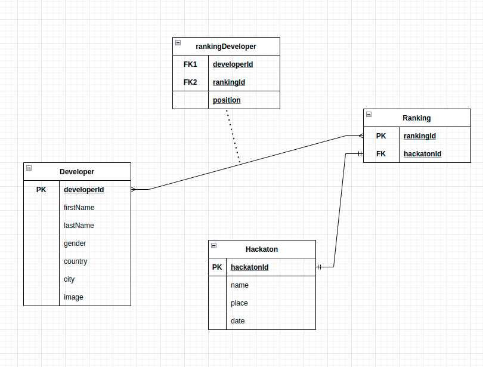
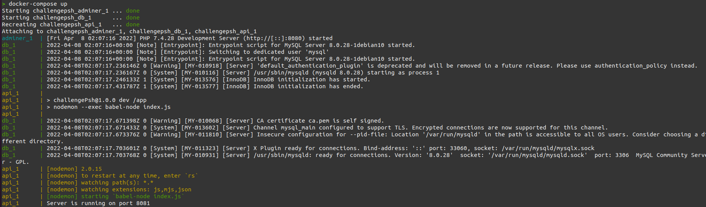
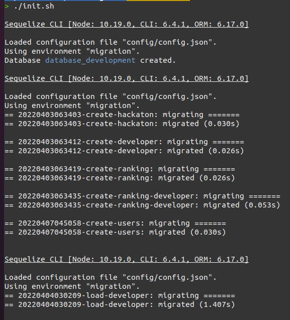
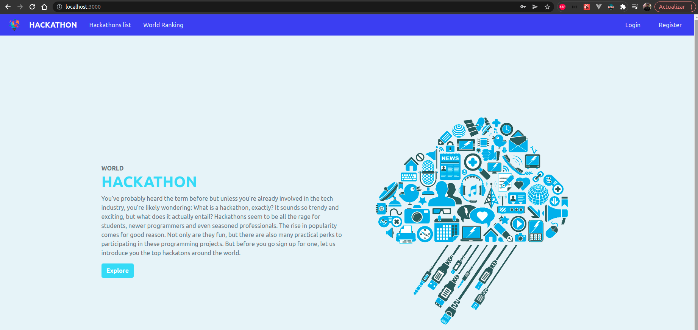
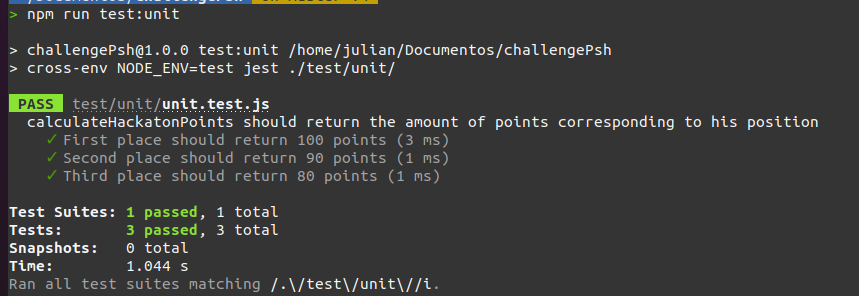
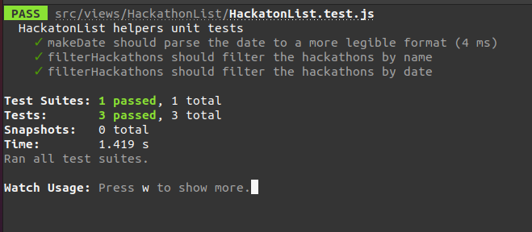

<div id="top"></div>
<!--
*** Thanks for checking out the Best-README-Template. If you have a suggestion
*** that would make this better, please fork the repo and create a pull request
*** or simply open an issue with the tag "enhancement".
*** Don't forget to give the project a star!
*** Thanks again! Now go create something AMAZING! :D
-->

<!-- PROJECT SHIELDS -->
<!--
*** I'm using markdown "reference style" links for readability.
*** Reference links are enclosed in brackets [ ] instead of parentheses ( ).
*** See the bottom of this document for the declaration of the reference variables
*** for contributors-url, forks-url, etc. This is an optional, concise syntax you may use.
*** https://www.markdownguide.org/basic-syntax/#reference-style-links
-->

[![LinkedIn][linkedin-shield]][linkedin-url]

<!-- PROJECT LOGO -->
<br />
<div align="center">
  

  <h3 align="center">Hackathon</h3>

  <p align="center">
    An awesome webapp to follow and notice the best developers around the world!
  </p>
</div>

<!-- TABLE OF CONTENTS -->
<details>
  <summary>Table of Contents</summary>
  <ol>
    <li>
      <a href="#about-the-project">About The Project</a>
      <ul>
        <li><a href="#built-with">Built With</a></li>
      </ul>
    </li>
    <li>
      <a href="#getting-started">Getting Started</a>
      <ul>
        <li><a href="#prerequisites">Prerequisites</a></li>
        <li><a href="#installation">Installation</a></li>
      </ul>
    </li>
    <li><a href="#rest">REST API</a></li>
  </ol>
</details>

<!-- ABOUT THE PROJECT -->

## About The Project

Each hackathon has developers and 3 winners (ranking 1st to 3rd). We will build a system that
looks for the best developers around the world by saving from each hackathon the best 10
developers.

In this site you be able to:

- View a list of hackathons and search them by name and date.
- View a global ranking of developers and the total money prize gained along the hackathons.
- Besides being able to create your user and navigate secure around the app.

Next i will show you the data model designed for this project:



Models:

- Developer
- Hackaton
- Ranking

Relations:

- Developer/Ranking N:N
- Hackaton/Ranking 1:1

Because of the relation between Developer and Ranking we got a mid table named rankingDeveloper.

Okay let's get started.

<p align="right">(<a href="#top">back to top</a>)</p>

### Built With

This section should list any major frameworks/libraries used to bootstrap your project. Leave any add-ons/plugins for the acknowledgements section. Here are a few examples.

- [Node.js](https://nodejs.org/) v14.19.1
- [Express.js](https://expressjs.com/)
- [React.js](https://reactjs.org/)
- [Docker](https://www.docker.com/)
- [docker-compose](https://docs.docker.com/compose/)
- [MySQL](https://www.mysql.com/)
- [Sequelize CLI](https://sequelize.org/docs/v6/other-topics/migrations/)
- [JWT](https://jwt.io/)
- [node-cron](https://www.npmjs.com/package/node-cron)
- [jest](https://jestjs.io/)
- [bcryptjs](https://www.npmjs.com/package/bcryptjs)
- [styled-components](https://styled-components.com/)
- [axios](https://axios-http.com/docs/intro)

<p align="right">(<a href="#top">back to top</a>)</p>

<!-- GETTING STARTED -->

## Getting Started

This is an example of how you may give instructions on setting up your project locally.
To get a local copy up and running follow these simple example steps.

### Prerequisites

This is an example of how to list things you need to use the software and how to install them.

- node and npm [download node v14.19.1](https://nodejs.org/es/download/)
- Install docker [ubuntu](https://docs.docker.com/engine/install/ubuntu/) or [windows](https://docs.docker.com/desktop/windows/install/)
- Install [docker-compose](https://docs.docker.com/compose/install/)
- `.env` and `config.json` files provided by the [author][linkedin-url]

### Installation

_Below is an example of how you can instruct your audience on installing and setting up your app. This template doesn't rely on any external dependencies or services._

1. Clone the repo
   ```sh
   git clone https://github.com/dondarrion91/challengePsh.git
   ```
2. Install NPM packages
   ```sh
   npm install
   ```
3. Enter `config.js` provided by the [author][linkedin-url] in `config` folder

4. Create a env file provided by the [author][linkedin-url] in the root folder

   ```touch
   .env.development
   ```

5. Build and start the services docker containers (api, db, adminer)

   ```
   docker-compose up
   ```

   If all is ok you should get an output like this one:

   

   This will expose 3 services:

   - REST API in [http://localhost:8081](http://localhost:8081)
   - Database administrator (Adminer) [http://localhost:8080](http://localhost:8080)
   - MySQL image running in port 3307(docker container)

   Now run the startup script `init.sh` to migrate the database tables and developer mock data

   ```
   ./init.sh
   ```

   You should get a similiar output like this one:

   

6. Start frontend client:

- Move to the client folder
  ```
  cd ./client
  ```
- Install NPM packages
  ```sh
  npm install
  ```
- Create a env file provided by the [author][linkedin-url] in the client folder
  ```touch
  .env.development
  ```
- Run the development server
  ```
  npm run dev
  ```
  - You should get a similiar output like this one:
    

7. Browse the application in: [http://localhost:3000](http://localhost:3000)

- 

<p align="right">(<a href="#top">back to top</a>)</p>

## REST API Documentation

**URL** : `http://localhost:8081/api/v1/register/`

<p id="rest">Used to create a new user and collect a Token for a registered User.</p>

**Method** : `POST`

**Auth required** : NO

**Data constraints**

```json
{
  "email": "[valid email address]",
  "password": "[password in plain text]"
}
```

**Data example**

```json
{
  "username": "iloveauth@example.com",
  "password": "abcd1234"
}
```

## Success Response

**Code** : `200 OK`

**Content example**

```json
{
  "message": "User with iloveauth@example.com created",
  "status": "OK",
  "code": 200
}
```

## Error Response

**Condition** : If 'username' and 'password' combination is wrong.

**Code** : `500 INTERNAL SERVER ERROR`

**Content** :

```json
{
  "message": "The user with email iloveauth@example.com already exist",
  "status": "INTERNAL SERVER ERROR",
  "code": 500
}
```

**URL** : `http://localhost:8081/api/v1/login/`

Used to collect a Token for a registered User.

**Method** : `POST`

**Auth required** : NO

**Data constraints**

```json
{
  "email": "[valid email address]",
  "password": "[password in plain text]"
}
```

**Data example**

```json
{
  "username": "iloveauth@example.com",
  "password": "abcd1234"
}
```

## Success Response

**Code** : `200 OK`

**Content example**

```json
{
  "message": "User with email iloveauth@example.com logged in",
  "status": "OK",
  "code": 200
}
```

## Error Response

**Condition** : If 'username' and 'password' combination is wrong.

**Code** : `404 NOT FOUND`

**Content** :

```json
{
  "message": "User Not Found, please try again...",
  "status": "Not Found",
  "code": 404
}
```

## Endpoints that require Authentication

Closed endpoints require a valid Token to be included in a http cookie.

### Developer related

Get data of all saved developers in the database.

**URL** : `http://localhost:8081/api/v1/developer/`

**Method** : `GET`

**Auth required** : YES

**Permissions required** : None

## Success Response

**Code** : `200 OK`

**Content examples**

**Filters** : `order`, `limit`

**URL** : `http://localhost:8081/api/v1/developer?order=hackatonPoints:desc&limit=10`

Order the developer data by hackatonPoints and limits the number to 10

```json
{
  "data": [
    {
      "id": 1,
      "firstName": "Ana",
      "lastName": "Nguyen",
      "gender": "female",
      "country": "France",
      "city": "Toulouse",
      "image": "https://randomuser.me/api/portraits/med/women/78.jpg",
      "hackatonPoints": 0
    },
    {
      "id": 2,
      "firstName": "Luka",
      "lastName": "Morin",
      "gender": "male",
      "country": "France",
      "city": "Aubervilliers",
      "image": "https://randomuser.me/api/portraits/med/men/10.jpg",
      "hackatonPoints": 0
    }
  ]
}
```

### Hackaton related

Get data of all saved hackaton his ranking of developers.

**URL** : `http://localhost:8081/api/v1/hackaton/`

**Method** : `GET`

**Auth required** : YES

**Permissions required** : None

## Success Response

**Code** : `200 OK`

**Content examples**

**Filters** : `id`

**URL** : `http://localhost:8081/api/v1/hackaton?id=1`

Get data of the hackathon with id 1.

```json
{
  "data": [
    {
      "id": 1,
      "name": "Hackaton Stevensbeek 2022",
      "place": "Netherlands - Stevensbeek",
      "date": "2022-04-08T00:25:00.000Z",
      "Ranking": {
        "id": 1,
        "Developers": [
          {
            "id": 122,
            "firstName": "Cars",
            "lastName": "Branderhorst",
            "gender": "male",
            "country": "Netherlands",
            "city": "Stevensbeek",
            "image": "https://randomuser.me/api/portraits/med/men/72.jpg",
            "hackatonPoints": 200,
            "RankingDeveloper": {
              "position": 1
            }
          },
          {
            "id": 222,
            "firstName": "Flora",
            "lastName": "Louis",
            "gender": "female",
            "country": "France",
            "city": "Pau",
            "image": "https://randomuser.me/api/portraits/med/women/54.jpg",
            "hackatonPoints": 90,
            "RankingDeveloper": {
              "position": 2
            }
          },
          {
            "id": 212,
            "firstName": "Armin",
            "lastName": "Vidal",
            "gender": "male",
            "country": "Switzerland",
            "city": "Assens",
            "image": "https://randomuser.me/api/portraits/med/men/35.jpg",
            "hackatonPoints": 80,
            "RankingDeveloper": {
              "position": 3
            }
          },
          {
            "id": 33,
            "firstName": "Anastasia",
            "lastName": "Figenschau",
            "gender": "female",
            "country": "Norway",
            "city": "Trondheim",
            "image": "https://randomuser.me/api/portraits/med/women/89.jpg",
            "hackatonPoints": 80,
            "RankingDeveloper": {
              "position": 4
            }
          },
          {
            "id": 254,
            "firstName": "باران",
            "lastName": "رضایی",
            "gender": "female",
            "country": "Iran",
            "city": "بوشهر",
            "image": "https://randomuser.me/api/portraits/med/women/4.jpg",
            "hackatonPoints": 0,
            "RankingDeveloper": {
              "position": 5
            }
          },
          {
            "id": 67,
            "firstName": "Hector",
            "lastName": "Perez",
            "gender": "male",
            "country": "Spain",
            "city": "Torrejón de Ardoz",
            "image": "https://randomuser.me/api/portraits/med/men/86.jpg",
            "hackatonPoints": 0,
            "RankingDeveloper": {
              "position": 6
            }
          },
          {
            "id": 77,
            "firstName": "Alice",
            "lastName": "Walker",
            "gender": "female",
            "country": "New Zealand",
            "city": "Upper Hutt",
            "image": "https://randomuser.me/api/portraits/med/women/61.jpg",
            "hackatonPoints": 0,
            "RankingDeveloper": {
              "position": 7
            }
          },
          {
            "id": 247,
            "firstName": "Juliette",
            "lastName": "Jean",
            "gender": "female",
            "country": "France",
            "city": "Limoges",
            "image": "https://randomuser.me/api/portraits/med/women/69.jpg",
            "hackatonPoints": 0,
            "RankingDeveloper": {
              "position": 8
            }
          },
          {
            "id": 282,
            "firstName": "Afşar",
            "lastName": "Aclan",
            "gender": "female",
            "country": "Turkey",
            "city": "Kırıkkale",
            "image": "https://randomuser.me/api/portraits/med/women/60.jpg",
            "hackatonPoints": 0,
            "RankingDeveloper": {
              "position": 9
            }
          },
          {
            "id": 177,
            "firstName": "الینا",
            "lastName": "پارسا",
            "gender": "female",
            "country": "Iran",
            "city": "نیشابور",
            "image": "https://randomuser.me/api/portraits/med/women/51.jpg",
            "hackatonPoints": 0,
            "RankingDeveloper": {
              "position": 10
            }
          }
        ]
      }
    }
  ]
}
```

## Unit testing

* Backend unit tests, in the root folder run:
    ```
    npm run test:unit
    ```
    - 

* Frontend unit tests, in the client folder run:
    ```
    npm test
    ```
    - 


Thank you very much! Good luck have fun!

Julián Sánchez - FullStack Developer :D

[linkedin-shield]: https://img.shields.io/badge/-LinkedIn-black.svg?style=for-the-badge&logo=linkedin&colorB=555
[linkedin-url]: https://www.linkedin.com/in/juli%C3%A1n-alejandro-s%C3%A1nchez-80a681163/
